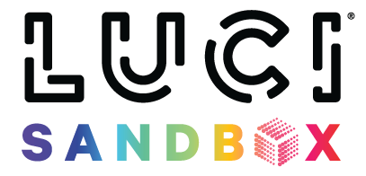

This is the public repo for the LUCI ROS2 SDK. 

All documentation for examples, packages, and use lives at  https://lucimobility.github.io/luci-sdk-docs/

## Docker Images
This repo supports multiple docker images in order to build and deploy them please see their respective folders README.md instructions.

## Documents

[Getting Started](docs/1_Getting-Started/1_getting-started.md)

[ROS2 Install](docs/2_Installation/1_ros-install.md)

[Installing Protobuf](docs/2_Installation/2_install-protobuf.md)

[Installing GRPC](docs/2_Installation/3_install-grpc.md)

[Installing SDK](docs/2_Installation/4_luci-ros2-sdk-install.md)

[Troubleshooting](docs/troubleshooting.md)

[Contributing](docs/CONTRIBUTING.md)

## LUCI Core Software and SDK Interdependency chart ##

The SDK version depends on the LUCI Core version installed on the chair. The table below outlines compatible versions of the SDK and related packages. LUCI Core and its SDK components are updated in sync, so it's important to ensure all versions match appropriately.

|LUCI Core Version | luci-ros2-sdk | luci-ros2-grpc | luci-ros2-msgs | luci-ros2-transforms | luci-ros2-keyboard-teleop | Status | ROS2 Version |
| ----------- | ----------- | ----------- | ----------- | ----------- | ----------- | ----------- | ----------- |
| 3.0.2 - 3.0.3 | 3.0.0 | 2.0.0 | 2.0.0 | 1.1.0 | 2.0.0 | Recommeded and Maintained | Humble |
| 2.0.3 - 2.0.8 | 2.1.0 | 1.1.0 - 1.4.0 | 1.1.0 - 1.4.0 | 1.1.0 | 1.0.0 | Not Actively Maintained | Humble |
| 2.0.1 - 2.0.2 | 2.0.0 | 1.0.0 | 1.0.0 | 1.0.0 | 1.0.0 | Not Actively Maintained | Humble |
| 1.5.2 - 2.0.0 | 1.2.2 | <1.0.0 | <1.0.0 | <1.0.0 | <1.0.0 | Not Actively Maintained | Humble |

## Releasing new version (FOR LUCI TEAM) ##
When an update has occurred to one of the SDK packages and a new version of the SDK is ready to be released there are a couple steps to follow. It is important to note that most of the process is automated for convenience and the process should be just a couple of button clicks. 

### Steps ### 
1. Update release version
    - This should be its own separate PR and should update the `versions.json` file located in the release directory with the new package versions. Make sure that you have already officially released the SDK package with the version you are changing it to or this build will fail.
    - LUCI follows [semver](https://semver.org/) style versioning so MAJOR.MINOR.PATCH versions are expected.
    - It is okay to not put out versions until multiple changes have happened to the code. 
2. Once the version increment is merged you simply need to create an official release in github.
    - This should trigger an action to auto run called `Create Release Documentation` which you can monitor in the github actions panel. This should generate a new release tab on the documentation site. 
3. Then to release the dev and public docker images go to github actions panel and run the `Create and Deploy Docker` action making sure to select both images. This should grab the released code, build the docker images for public use and push them to jrog artifactory.  

If everything went smoothly congratulations the new docker images with packages and docs will be released and publicly distributable.

Always update the dependency table in the `README.md` whenever any package is released. Keeping these tables in sync with the latest versions ensures consistency and accuracy across the documentation.

<b>NOTE: Once a PR is merged into the `main` branch the docs site in the `next` version will update with it that evening.</b>